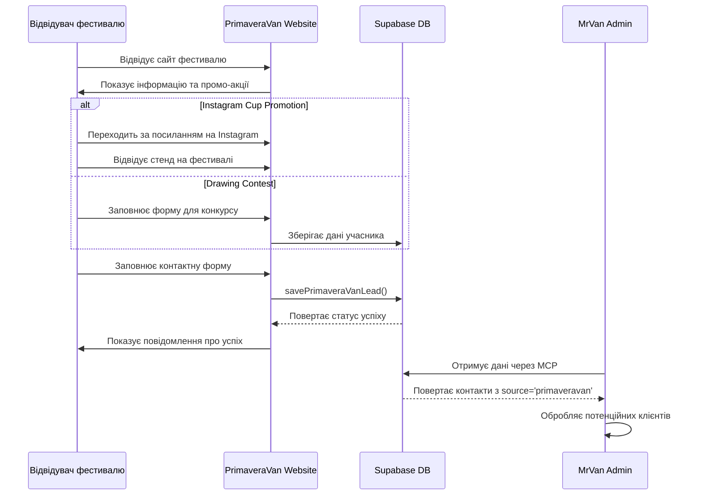
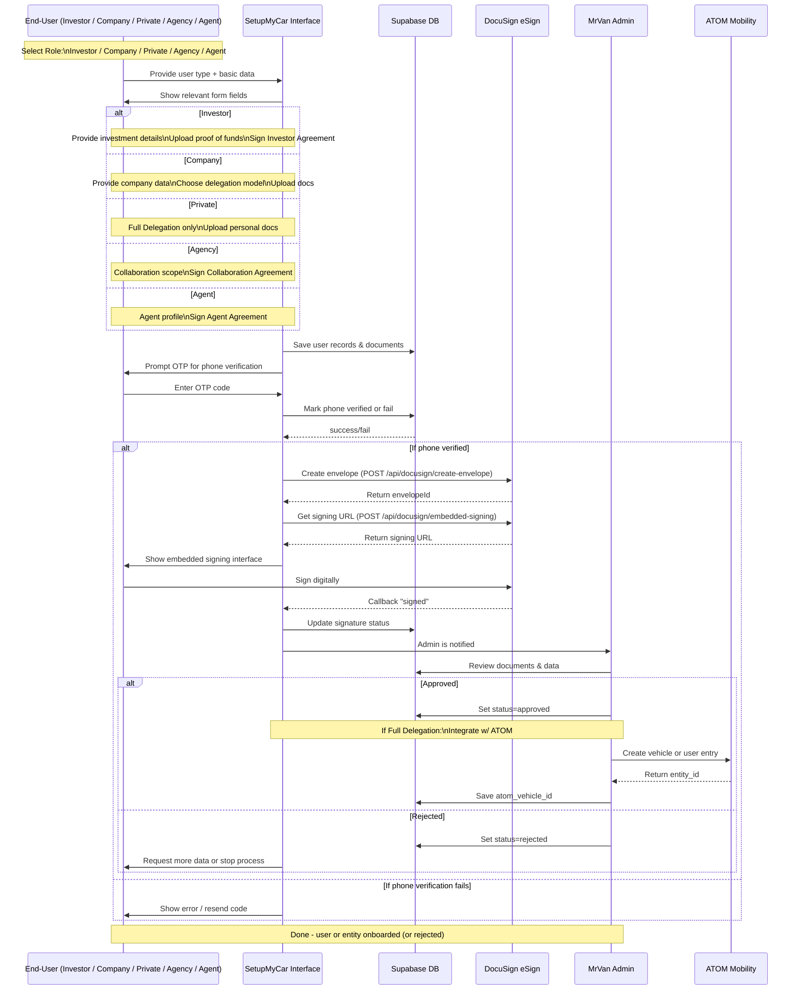

# App Flow

🚀 **Version:** 0.7 (Updated with PrimaveraVan Festival integration)  
📅 **Date:** 2025-05-09
👨‍💻 **Authors:** Ilia

---


### 2.11 PrimaveraVan Festival Subproject

🎪 **PrimaveraVan Festival** - це спеціальний маркетинговий мікросайт для фестивалю:

- 🌍 **Багатомовний інтерфейс** - підтримує англійську, іспанську та каталанську мови
- 🎟️ **Промо-акції** - підписка на Instagram для отримання фестивального стакану та конкурс малюнків
- 📱 **Форма для збору контактів** - інтеграція з Supabase для збереження потенційних клієнтів
- 📊 **Потік даних:**
  1. Користувач заповнює форму з контактними даними
  2. Дані зберігаються в Supabase з маркером `source: 'primaveravan'`
  3. Користувач отримує підтвердження успішної реєстрації
  4. Адміністратор може переглядати зібрані контакти через MCP

#### 2.11.1 Технічні особливості PrimaveraVan

- 🌐 **Проста HTML/CSS/JS реалізація** - статичний сайт з мінімальними залежностями
- 🔄 **Інтеграція з Supabase** - використання Supabase для збереження даних форм
- 🌍 **Багатомовність** - використання JSON-файлу для перекладів та JavaScript для перемикання мов
- 📱 **Адаптивний дизайн** - оптимізовано для мобільних та десктопних пристроїв
- 📊 **Функції форми:**
  - Валідація полів
  - Збереження даних в Supabase через API
  - Відображення повідомлення про успіх після відправки

#### 2.11.2 API Endpoint для PrimaveraVan

🔹 **Функція:** `window.PrimaveravanAPI.savePrimaveraVanLead`  
🔹 **Параметри:**
  - `name` - Ім'я користувача
  - `email` - Email користувача
  - `instagram` - Instagram профіль (опціонально)
  - `privacy_accepted` - Чи прийнято політику конфіденційності
  - `source` - Встановлюється як 'primaveravan'
  - `created_at` - Дата створення запису
  
🔹 **Відповідь:** 
```json
{
  "success": true
}
```

#### 2.11.3 Діаграма потоку даних PrimaveraVan



---

## 3. API Endpoints для DocuSign

### 3.1 Створення Конверта для Підписання

🔹 **Endpoint:** `/api/docusign/create-envelope`  
🔹 **Метод:** POST  
🔹 **Параметри запиту:**
  - `documentId` - ID документа
  - `signerEmail` - Email підписанта
  - `signerName` - Ім'я підписанта
  - `documentPath` - Шлях до документа для підписання
  
🔹 **Відповідь:** 
```json
{
  "success": true,
  "envelopeId": "abc123-xyz789"
}
```

### 3.2 Отримання URL для Вбудованого Підписання

🔹 **Endpoint:** `/api/docusign/embedded-signing`  
🔹 **Метод:** POST  
🔹 **Параметри запиту:**
  - `envelopeId` - ID конверта для підписання
  - `returnUrl` - URL для повернення після підписання
  - `signerEmail` - Email підписанта
  - `signerName` - Ім'я підписанта
  - `signerClientId` - (опціонально) ID клієнта
  
🔹 **Відповідь:** 
```json
{
  "success": true,
  "signingUrl": "https://demo.docusign.net/Signing/..."
}
```

---

## 4. Visual Flow (Mermaid Sequence Diagram)

