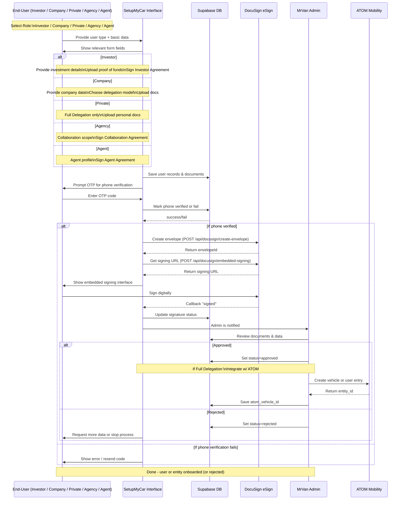

# App Flow

🚀 **Version:** 0.5 (Updated with DocuSign integration)  
📅 **Date:** 2025-04-01  
👨‍💻 **Authors:** Ilia, Andrea  

---

## 1. Overview

🔎 This document describes the **current flow** for different market participants who can work with the MrVan platform:

- **Investors**  
- **Delegating Company Owners** (companies that delegate their campers)  
- **Delegating Private Owners** (private individuals who delegate their campers)  
- **Collaborator Agencies**  
- **Collaborator Agents**

It also covers the typical registration (onboarding) flow for B2B users (and private owners) to add a camper, verify via phone (OTP), sign a DocuSign contract, and proceed to admin approval. If needed—especially for "Full Delegation" cases—the system integrates with ATOM Mobility.

---

## 2. Detailed Flow

### 2.1 Entry: Choose Role

⚡ 1. A **user** visits the platform (Landing Page or "SetupMyCar").  
🗂 2. The system asks: **"What is your role?"**  
   - Investor  
   - Delegating Company Owner  
   - Delegating Private Owner  
   - Collaborator Agency  
   - Collaborator Agent  
🔀 3. Depending on the user's choice, relevant forms and flows are displayed.

---

### 2.2 Flow for **Investor**

💼 1. **Profile & Investment Goals**  
   - Provide personal/corporate info (name, contacts).  
   - Indicate approximate investment amount, region(s) of interest.  

📑 2. **Document Upload**  
   - Proof of Funds (e.g., bank statement)  
   - ID documents (passport or other valid ID)  

📝 3. **Agreements to Sign**  
   - NDA (Non-Disclosure Agreement)  
   - Investor Agreement  

✅ 4. **Admin Review**  
   - Admin checks all details and approves or requests additional info.

---

### 2.3 Flow for **Delegating Company Owner**

> **Note:** Companies delegating their campers can choose: "Service Only," "Partial Help," or "Full Delegation."

🏢 1. **Company Registration**  
   - Company name, registration number, contact info  
   - Select delegation model (Service Only / Partial / Full)  

🚐 2. **Vehicle Information**  
   - Camper details (make, model, year, VIN or plate)  
   - Upload ownership documents, insurance/registration  

📝 3. **Delegation Agreement**  
   - Sign the relevant Delegation Agreement via eSign (DocuSign)  

📱 4. **Phone Verification (OTP)**  
   - User enters phone number → receives SMS code → verifies  

🔍 5. **Admin Review**  
   - Admin checks documents and signature  
   - If "Full Delegation," then the ATOM Mobility integration may follow

---

### 2.4 Flow for **Delegating Private Owner**

> **Note:** Private owners may only opt for "Full Delegation."

🏠 1. **User Profile**  
   - Personal details (name, address, phone)  

🚐 2. **Camper Details**  
   - Make, model, year, license plate  
   - Ownership proof (registration)  
   - Insurance  

📝 3. **Sign Agreement**  
   - Private Delegation Agreement (DocuSign)  

📱 4. **Phone Verification (OTP)**  
   - Submit phone number → get code → verify  

🔍 5. **Admin Review**  
   - Admin checks documents and signatures  
   - If approved, possible ATOM Mobility integration for Full Delegation

---

### 2.5 Flow for **Collaborator Agency**

🤝 1. **Agency Details**  
   - Name, registration number, contact details  

📐 2. **Collaboration Scope**  
   - Type of collaboration (rentals, marketing, shared management, etc.)  
   - Experience and portfolio (if needed)  

📝 3. **Sign Collaboration Agreement**  
   - Outlining responsibilities and revenue shares  

🔍 4. **Admin Review**  
   - Validate registration documents, licenses  
   - Optional access to fleet management system

---

### 2.6 Flow for **Collaborator Agent**

👥 1. **Agent Profile**  
   - Personal background, experience, region of operation  

🔎 2. **Additional Credentials**  
   - Any certifications or references  

📝 3. **Sign Agent Agreement**  
   - Defines commission, responsibilities, timeframes  

📚 4. **Optional Training**  
   - Overview of booking system, platform usage  

🔍 5. **Admin Review**  
   - Approve or request more info

---

### 2.7 B2B Flow (Traditional) for Adding a Camper (Updated)

Below is the **typical scenario** (historically developed) for B2B users or private individuals adding a camper:

1. **Step 1: "Who Are You?"**  
   - If private → Full Delegation  
   - If company → choose "Service Only," "Partial Help," or "Full Delegation"

2. **Step 2: Enter Camper Data**  
   - User fills camper details (make, model, year, plate)  
   - System creates a record in the DB (status = draft)

3. **Step 3: Upload Documents**  
   - Insurance, registration, ownership, etc.

4. **Step 4: Finish Setup (Preview)**  
   - Confirm everything is correct

5. **Step 5: Phone OTP**  
   - User enters phone number → gets SMS code  
   - System verifies or fails

6. **Step 6: eSign (DocuSign)**  
   - The system sends an agreement corresponding to user type and delegation model  
   - On successful signing → `signed_at` / `signature_status = signed`
   - Uses JWT authentication for secure API access

7. **Step 7: Admin Processing & Approval**  
   - Admin reviews docs, contract, status  
   - Sets "approved," "rejected," or "needs_more_info"

8. **Step 8: Integration with ATOM**  
   - If "Full Delegation" → create vehicle via ATOM API  
   - Save `atom_vehicle_id` in `vehicles` table

9. **Result**  
   - "Approved" → camper is available according to the chosen delegation mode
   - "Rejected" → user must correct or provide additional data

### 2.8 DocuSign Інтеграція

📑 **DocuSign eSignature** використовується для безпечного електронного підписання документів:

- 🔑 **JWT Авторизація** - безпечна авторизація через JWT токени
- 📤 **Створення Конвертів** - API для створення документів для підписання
- 📲 **Вбудоване Підписання** - інтегроване підписання без необхідності виходу на зовнішні сайти
- 📊 **Моніторинг Статусу** - відстеження процесу підписання в реальному часі
- 🔧 **Необхідні Змінні Середовища**:
  - `DOCUSIGN_USER_ID`
  - `DOCUSIGN_ACCOUNT_ID`
  - `DOCUSIGN_INTEGRATION_KEY`
  - `DOCUSIGN_BASE_PATH`
  - `DOCUSIGN_PRIVATE_KEY`

### 2.9 Моніторинг Процесів через MCP

🔍 **MCP (Monitoring Control Panel)** використовується для моніторингу всіх процесів:

- 📊 **Відстеження Статусів** - моніторинг прогресу кожного користувача в процесі онбордингу
- 🚫 **Виявлення Блокерів** - ідентифікація причин затримок чи відмов
- 📱 **Верифікація OTP** - огляд статистики успішних/невдалих верифікацій
- 📝 **Контроль Документів** - моніторинг статусів підписання через DocuSign
- 🔗 **Інтеграції** - відстеження статусу інтеграцій з ATOM Mobility
- 🧪 **Дані Supabase** - прямий доступ до даних для аналізу та корекції

---

## 3. API Endpoints для DocuSign

### 3.1 Створення Конверта для Підписання

🔹 **Endpoint:** `/api/docusign/create-envelope`  
🔹 **Метод:** POST  
🔹 **Параметри запиту:**
  - `documentId` - ID документа
  - `signerEmail` - Email підписанта
  - `signerName` - Ім'я підписанта
  - `documentPath` - Шлях до документа для підписання
  
🔹 **Відповідь:** 
```json
{
  "success": true,
  "envelopeId": "abc123-xyz789"
}
```

### 3.2 Отримання URL для Вбудованого Підписання

🔹 **Endpoint:** `/api/docusign/embedded-signing`  
🔹 **Метод:** POST  
🔹 **Параметри запиту:**
  - `envelopeId` - ID конверта для підписання
  - `returnUrl` - URL для повернення після підписання
  - `signerEmail` - Email підписанта
  - `signerName` - Ім'я підписанта
  - `signerClientId` - (опціонально) ID клієнта
  
🔹 **Відповідь:** 
```json
{
  "success": true,
  "signingUrl": "https://demo.docusign.net/Signing/..."
}
```

---

## 4. Visual Flow (Mermaid Sequence Diagram)

